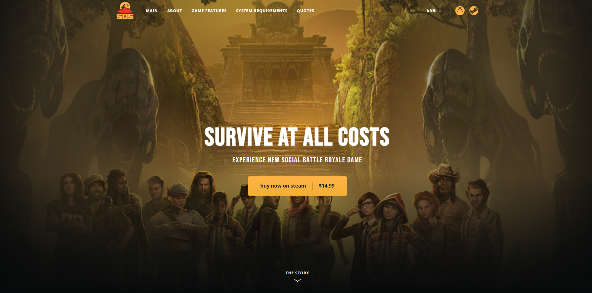
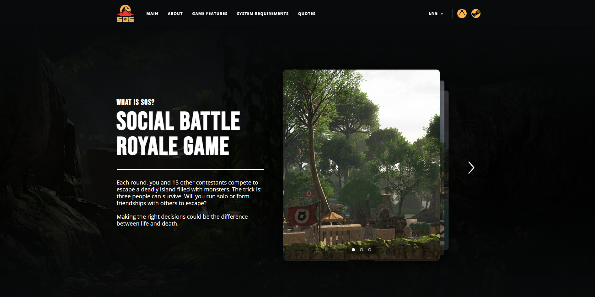
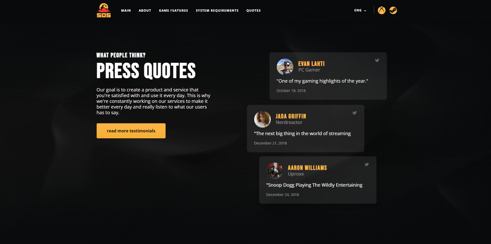

# 🎮 SOS - Social Battle Royale Game Landing Page

<div align="center">
  
  
  ### Experience New Social Battle Royale Game
  
  [](https://developer.mozilla.org/en-US/docs/Web/HTML)
  [](https://developer.mozilla.org/en-US/docs/Web/CSS)
  [](https://developer.mozilla.org/en-US/docs/Web/JavaScript)
  [](https://developer.mozilla.org/en-US/docs/Learn/CSS/CSS_layout/Responsive_Design)

  [Live Demo](#) • [Report Bug](#) • [Request Feature](#)
</div>

---

## 📋 Table of Contents

- [About The Project](#about-the-project)
- [Features](#features)
- [Screenshots](#screenshots)
- [Technologies Used](#technologies-used)
- [Getting Started](#getting-started)
- [Responsive Design](#responsive-design)
- [Project Structure](#project-structure)
- [Contact](#contact)

---

## 🎯 About The Project

A modern, fully responsive landing page for **SOS - Social Battle Royale Game**. This project showcases a premium gaming website with engaging animations, interactive elements, and a pixel-perfect implementation based on Figma design.

### Key Highlights:

✨ **Pixel-Perfect Design** - Faithfully recreated from Figma mockups  
📱 **Fully Responsive** - Optimized for all devices (320px - 1920px+)  
🎨 **Modern UI/UX** - Sleek animations and smooth transitions  
⚡ **Performance Optimized** - Fast loading times and optimized assets  
♿ **Accessible** - Semantic HTML and ARIA compliance  
🎭 **Interactive Gallery** - 3D card stack slider with smooth transitions

---

## ✨ Features

### 🎨 UI Components

- **Fixed Navigation Header** with language selector and platform icons
- **Hero Section** with compelling CTA and background effects
- **Interactive Image Gallery** with 3D stacked card effect
- **Feature Showcase** with timeline design
- **System Requirements** table with responsive layout
- **Testimonials Section** with staggered card layout
- **Newsletter Subscription** form with validation
- **Responsive Footer** with social links

### 🔧 Technical Features

- **Mobile-First Approach** with progressive enhancement
- **CSS Grid & Flexbox** for modern layouts
- **Custom Animations** and transitions
- **Optimized Images** with proper lazy loading
- **Cross-Browser Compatible**
- **SEO Optimized** with meta tags and semantic HTML
- **Smooth Scrolling** navigation
- **Burger Menu** for mobile devices

---

## 📸 Screenshots

<div align="center">
  
  <p><i>Hero Section with Call-to-Action</i></p>
</div>

<div align="center">
  
  <p><i>Interactive 3D Card Stack Gallery</i></p>
</div>

<div align="center">
  
  <p><i>Game Features and User Testimonials</i></p>
</div>

---

## 🛠️ Technologies Used

### Frontend
- **HTML5** - Semantic markup
- **CSS3** - Modern styling with custom properties
- **Vanilla JavaScript** - Interactive functionality
- **CSS Grid & Flexbox** - Advanced layouts
- **CSS Animations** - Smooth transitions and effects

### Design
- **Figma** - Design source
- **Google Fonts** - Bebas Neue, Open Sans
- **SVG Icons** - Scalable vector graphics

### Tools
- **Git** - Version control
- **VS Code** - Code editor
- **Chrome DevTools** - Debugging and testing

---

## 🚀 Getting Started

### Prerequisites

No build tools or dependencies required! This is a pure HTML/CSS/JS project.

### Installation

1. **Clone the repository**
   ```bash
   git clone https://github.com/yourusername/sos-landing-page.git
   ```

2. **Navigate to the project directory**
   ```bash
   cd sos-landing-page
   ```

3. **Open in browser**
   ```bash
   # Simply open index.html in your browser
   # Or use a local server (recommended):
   npx serve .
   # Or with Python:
   python -m http.server 8000
   ```

4. **Visit** `http://localhost:8000` in your browser

---

## 📱 Responsive Design

The website is fully responsive and optimized for all screen sizes:

| Breakpoint | Screen Size | Layout |
|------------|-------------|--------|
| **Desktop** | ≥1200px | Full featured layout with side-by-side sections |
| **Tablet** | ≤1024px | Stacked sections, adjusted typography |
| **Medium** | ≤900px | Single column quotes, optimized spacing |
| **Mobile** | ≤768px | Hamburger menu, vertical layout |
| **Small Mobile** | ≤480px | Compact design, touch-optimized |
| **Extra Small** | ≤360px | Minimal spacing, essential content |

### Tested On:
- ✅ Chrome (latest)
- ✅ Firefox (latest)
- ✅ Safari (latest)
- ✅ Edge (latest)
- ✅ Mobile Safari (iOS)
- ✅ Chrome Mobile (Android)

---

## 📁 Project Structure

```
sos-landing-page/
│
├── index.html              # Main HTML file
├── css/
│   └── style.css          # Main stylesheet with responsive design
├── js/
│   └── script.js          # Interactive functionality
├── images/
│   ├── screenshot-1.png   # Hero section preview
│   ├── screenshot-2.png   # Gallery section preview
│   ├── screenshot-3.png   # Features section preview
│   ├── logo.png           # Brand logo
│   ├── hero-bg-*.png      # Background images
│   ├── quote-photo-*.png  # Testimonial avatars
│   └── *.svg              # Icon files
└── README.md              # Project documentation
```

---

## 🎨 Design Decisions

### Color Palette
```css
--color-primary: #FFB548      /* Golden Yellow */
--color-secondary: #F3AF34    /* Warm Orange */
--color-dark: #080A0B         /* Deep Black */
--color-text: #FFFFFF         /* Pure White */
```

### Typography
- **Headings**: Bebas Neue (Bold, Uppercase)
- **Body Text**: Open Sans (Regular, Semi-Bold)
- **Font Sizes**: Fluid typography (28px - 80px for headings)

### Key Features Implementation

#### 3D Gallery Stack Effect
```css
.gallery__slide[data-index="0"] {
    z-index: 3;
    transform: translate(0, 0) scale(1);
}
.gallery__slide[data-index="1"] {
    transform: translate(35px, 8px) scale(0.90) rotateY(-5deg);
}
```

#### Responsive Grid System
```css
.quotes .container {
    display: grid;
    grid-template-columns: 480px 1fr;
    /* Adapts to 1fr on mobile */
}
```

---

## 🙏 Acknowledgments

- Design inspiration from modern gaming websites
- Figma design templates
- Google Fonts for typography
- Icons8 for iconography
- Community feedback and support

---

<div align="center">
  
### ⭐ Star this repo if you found it helpful!

Made with ❤️ and ☕

</div>

